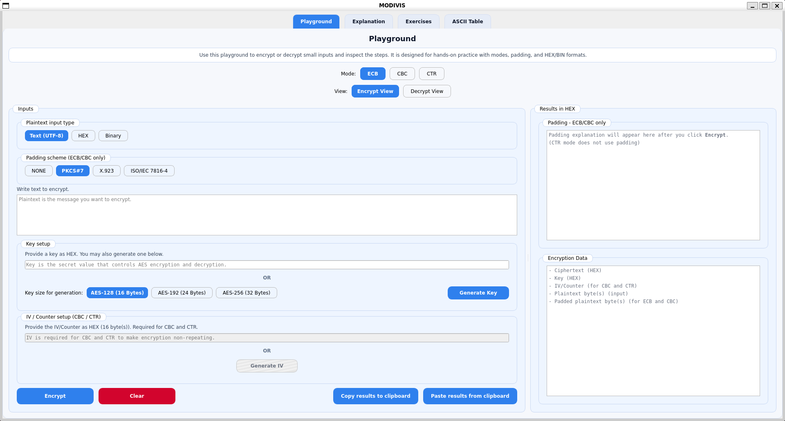
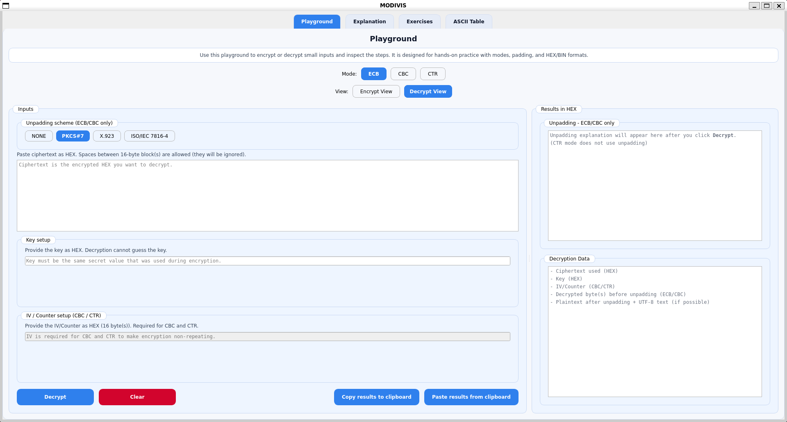
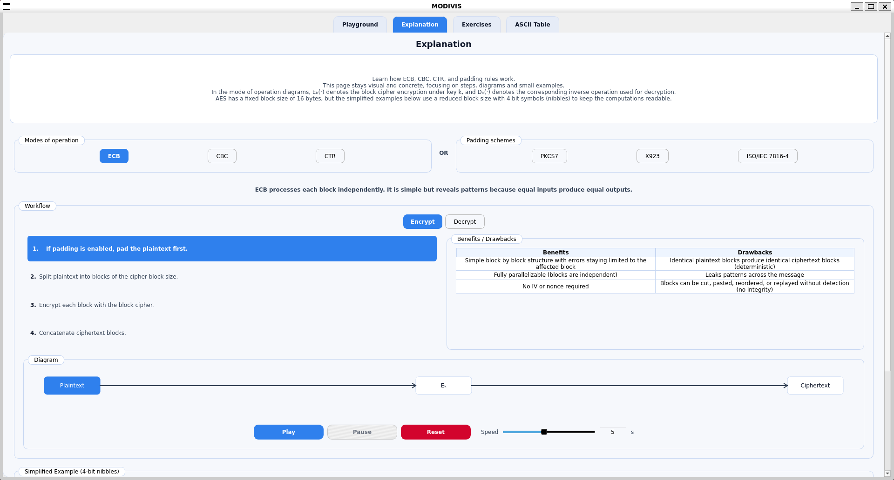
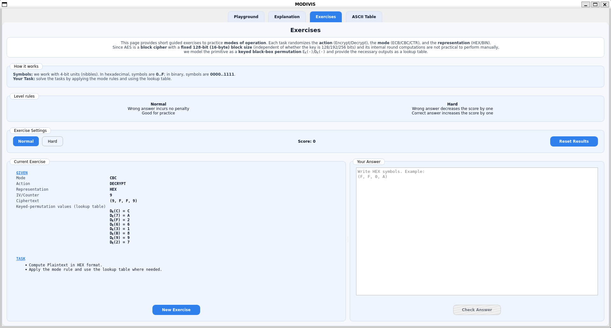
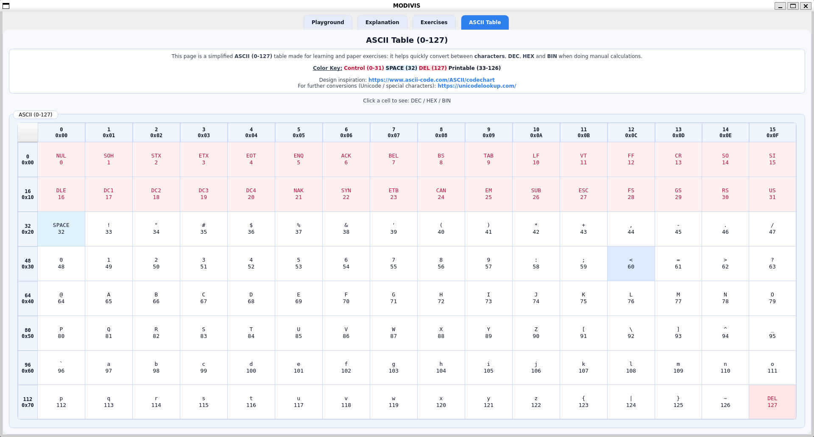

# MODIVIS: Interactive Python Application for the Visualization of Modes of Operation in Cryptography

## Abstract
This project is an interactive desktop application for studying modes of operation and padding schemes. It combines a full GUI playground for real AES encryption/decryption with explanatory visualizations, guided exercises and an ASCII reference table. The overall goal is to support structured learning in cryptography courses and self-study settings.

## Learning Objectives
- Understand the fixed AES block size (128-bit / 16 bytes) and key sizes (128/192/256 bits).
- Compare ECB, CBC and CTR workflows and their security trade-offs.
- Practice padding rules (PKCS7, X9.23 a.k.a. X923 in the UI, ISO/IEC 7816-4).
- Different representations (TEXT, HEX, and BIN).
- Solve modes of operation exercises using a simplified didactic cipher model.

## Features Overview

### Playground Page


- Encrypt and decrypt using AES in ECB, CBC and CTR modes.
- Input formats: TEXT (UTF-8), HEX (raw bytes), BIN (raw bits).
- Key generation for AES-128/192/256 and IV/Counter generation for CBC/CTR.
- Padding/unpadding visualization and explanations for ECB/CBC.
- Output formatting into 16-byte blocks with byte-level tokenization.
- Clipboard workflow to copy/paste encryption or decryption payloads.

### Explanation Page

- Step-by-step diagrams for ECB, CBC and CTR with play/pause controls.
- Workflow lists that sync with animated diagrams.
- Benefits and drawbacks tables for each mode.
- Dedicated padding section with explicit rules and worked examples.

### Exercises Page

- Short exercises that randomize action (Encrypt/Decrypt), mode (ECB/CBC/CTR) and representation (HEX/BIN).
- Uses a toy nibble-based (4-bit) keyed permutation instead of real AES rounds to make it easier to solve it.
- Oracle lookup tables are generated to support manual reasoning.
- Scoring system with Normal and Hard difficulty levels.

### ASCII Page

- 7-bit ASCII table (0-127) with DEC/HEX/BIN and labels.
- Color-coded categories: control codes, space, printable, delete.

## Cryptography Scope and Limitations
- The playground uses the `cryptography` library for real AES encryption.
- No authentication is provided (no MAC). This is strictly a learning tool and must not be used for production security (or at least not yet).
- ECB leaks patterns and is included only for instructional comparison.
- CBC and CTR are malleable without integrity checks.
- Exercises are intentionally simplified and are not AES.

## Architecture
The codebase follows a layered MVVM structure:

- `src/gui/`: PySide6 GUI pages and the main window.
- `src/viewmodels/`: UI facing view models that format outputs and map errors.
- `src/services/`: workflow services for encryption/decryption and exercises.
- `src/models/`: AES core and mode wrappers (ECB/CBC/CTR).
- `src/utils/`: parsing, padding schemes, formatting, logging and randomness.
- `src/domain/`: shared types and constants for modes, padding and inputs.
- `tests/`: pytest suite covering utils, models, services and viewmodels.

## Input and Output Conventions
- TEXT input is interpreted as UTF-8 bytes.
- HEX input accepts whitespace and optional `0x` prefixes.
- BIN input accepts whitespace and optional `0b` prefixes.
- AES key sizes must be 16/24/32 bytes (32/48/64 hex characters).
- CBC and CTR require a 16-byte IV/Counter (32 hex characters).
- Supported padding modes: NONE, PKCS7, X923, ISO/IEC 7816-4.
- CTR strictly forbids padding.
- ECB/CBC can use padding or require block alignment.

## Requirements
- Python 3.10+
- Dependencies (see `requirements.txt`):
  - `cryptography` (AES primitives)
  - `PySide6` (GUI)
  - `pytest` (tests)
- Linux/WSL: Qt XCB runtime packages: the application forces `QT_QPA_PLATFORM=xcb` for stability. If you need a different backend on your system, adjust `main.py` accordingly.

## Setup

### Install Requirements
```bash
pip install -r requirements.txt
```

### Run
```bash
python main.py
```

## Logging and Diagnostics
- Console logs include INFO/WARNING/ERROR and a SUCCESS level.
- If `/dev/log` exists (Linux), logs are also forwarded to syslog/journald.
- Debug logging can be enabled in `src/utils/logger.py`.

## Linux/WSL System Dependencies
Even on WSL Ubuntu, system package availability and Qt runtime behavior can vary across versions and setups, so the commands below are provided without guarantee and you should follow any Qt platform plugin error messages to install the missing OS libraries on your system.

On my WSL Ubuntu setup, I installed the following XCB packages to satisfy the Qt platform plugin requirements:

```bash
sudo apt update
sudo apt install -y \
  libxcb-cursor0 \
  libx11-xcb1 \
  libxcb1 \
  libxcb-util1 \
  libxcb-render0 \
  libxcb-render-util0 \
  libxcb-shape0 \
  libxcb-xfixes0 \
  libxcb-xinerama0 \
  libxcb-randr0 \
  libxcb-image0 \
  libxcb-keysyms1 \
  libxcb-icccm4 \
  libxcb-shm0 \
  libxcb-sync1 \
  libxcb-xkb1 \
  libxkbcommon-x11-0
```

## References
- ASCII table inspiration: https://www.ascii-code.com/ASCII/codechart
- Unicode lookup: https://unicodelookup.com/
